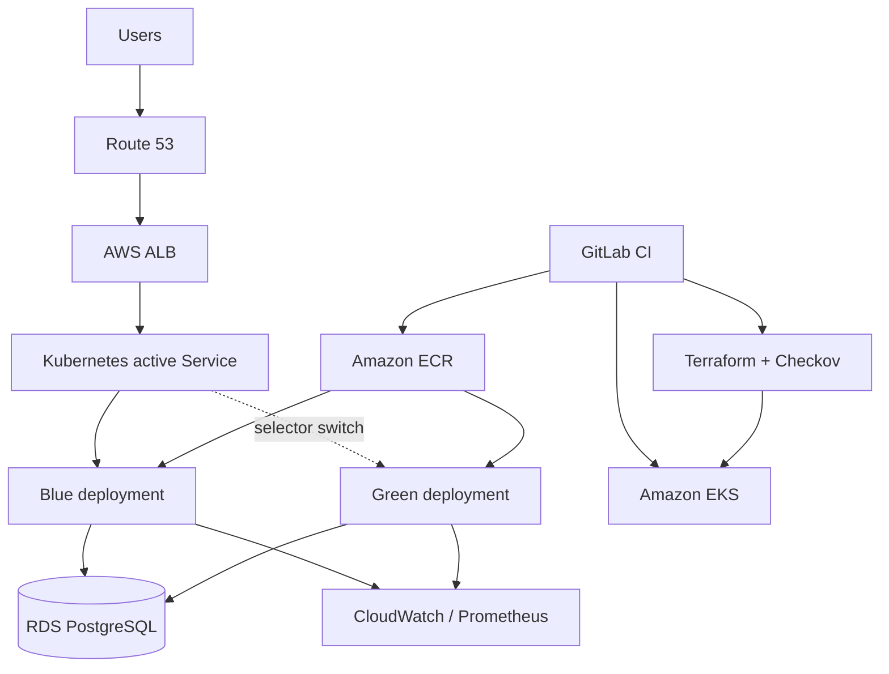

# EPAM AWS DevOps interview project

Production-style AWS/EKS foundation provisioned with Terraform and deployed from GitLab CI using a blue-green release strategy.

## Architecture



The VPC spans three Availability Zones. Public subnets host internet-facing load balancers and NAT gateways; private subnets host EKS nodes. Terraform state is held in encrypted, versioned S3 with DynamoDB locking. Workloads use IRSA/Pod Identity rather than static AWS keys.

## Repository layout

- `bootstrap/`: one-time remote-state resources.
- `terraform/`: VPC, EKS, ECR, logging and cluster access.
- `k8s/`: blue/green Kubernetes resources and switch/rollback scripts.
- `.gitlab-ci.yml`: validation, security, build, deploy, verification, promotion and rollback.
- `INTERVIEW_GUIDE.md`: answers tailored to a first-round EPAM interview.
- `SECURITY_PIPELINE.md`: accurate SAST/DAST/SCA/container/IaC tool placement.

## Deploy

1. Run `bootstrap` once and copy the outputs into `terraform/backend.hcl` (do not commit account-specific values).
2. Set GitLab OIDC variables: `AWS_ROLE_ARN`, `AWS_REGION`, `EKS_CLUSTER_NAME`, `ECR_REPOSITORY`.
3. Build and publish an internal `ci-tools:1.0` image containing pinned AWS CLI, Terraform, kubectl, Docker CLI and Trivy versions; restrict who can update it.
4. Bootstrap the Kubernetes objects once with a known-good image: `sed 's|IMAGE_PLACEHOLDER|ACCOUNT.dkr.ecr.eu-west-2.amazonaws.com/REPO:TAG|g' k8s/application.yaml | kubectl apply -f -`.
5. Add protected production environment approval in GitLab.
6. Run merge-request validation, then apply the saved Terraform plan from the default branch.
7. A release deploys only to the inactive colour, verifies it through the preview service, and requires a manual promotion before switching production traffic.

## Important production decisions

- No long-lived AWS access keys in GitLab; use GitLab OIDC federation and short-lived STS credentials.
- Pin tool/container versions and base images by digest in a real delivery repository.
- Database changes must be backward compatible during a blue-green window (expand, migrate, contract).
- Promotion and rollback are explicit, auditable jobs. The previous colour remains running until the observation window passes.
- Add AWS WAF, ACM and Route 53 records when the domain and certificate requirements are known.

## Local validation

```bash
terraform -chdir=bootstrap fmt -check
terraform -chdir=terraform fmt -check
terraform -chdir=terraform init -backend=false
terraform -chdir=terraform validate
checkov -d terraform
kubectl apply --dry-run=client -f k8s/
```


I’m Augustine, a DevOps and Cloud Engineer with several years of experience working across AWS and Azure environments, with a strong focus on infrastructure automation, CI/CD, cloud security, reliability and production operations.

One of my strongest AWS experiences was at Kainos, where I worked on the DWP Common Risk Engine, which was a machine-learning-based fraud and risk platform. I worked with AWS services including Lambda, SQS, API Gateway, SageMaker, S3, KMS and IAM. A major part of my responsibility was automating infrastructure and deployments, while making sure security, least-privilege access, monitoring and reliability were built into the platform.

I also have strong Infrastructure-as-Code experience with Terraform. For example, at The Very Group, I worked with Terraform for AWS infrastructure and integrated Checkov into the pipeline to identify security and compliance issues before infrastructure changes reached production.

On the CI/CD side, I’ve built and maintained pipelines using GitLab CI, Jenkins, GitHub Actions and Azure DevOps. My pipelines typically include build, testing, security scanning, packaging and deployment stages. I’ve also worked with security tooling such as SonarQube, Snyk and Aqua, and I’m comfortable with integrating SAST, dependency, container, infrastructure and DAST checks into the delivery process.

I also have hands-on experience with deployment strategies such as Blue-Green and progressive delivery. My approach is to combine automated health checks and monitoring with controlled traffic switching, so that if the new version fails its validation criteria, we can quickly roll back to the stable version.
More recently, I’ve been working heavily with Kubernetes, particularly EKS and AKS, Terraform, GitOps, Argo CD and Argo Rollouts, as well as Prometheus and Grafana for observability. I’ve also been developing my Python skills further for infrastructure and operational automation.

What particularly interests me about this EPAM role is that it brings together the areas I’ve been working with throughout my career: AWS, Terraform, CI/CD, security, automation, resilient deployment strategies and production operations. I think my combination of hands-on cloud engineering and production experience would allow me to contribute effectively while continuing to grow within a large engineering environment like EPAM. 


