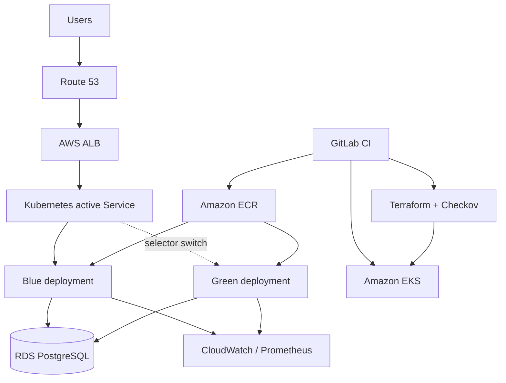

# EPAM AWS DevOps interview project

Production-style AWS/EKS foundation provisioned with Terraform and deployed from GitLab CI using a blue-green release strategy.

## Architecture



The VPC spans three Availability Zones. Public subnets host internet-facing load balancers and NAT gateways; private subnets host EKS nodes. Terraform state is held in encrypted, versioned S3 with DynamoDB locking. Workloads use IRSA/Pod Identity rather than static AWS keys.

## Repository layout

- `bootstrap/`: one-time remote-state resources.
- `terraform/`: VPC, EKS, ECR, logging and cluster access.
- `k8s/`: blue/green Kubernetes resources and switch/rollback scripts.
- `.gitlab-ci.yml`: validation, security, build, deploy, verification, promotion and rollback.
- `INTERVIEW_GUIDE.md`: answers tailored to a first-round EPAM interview.
- `SECURITY_PIPELINE.md`: accurate SAST/DAST/SCA/container/IaC tool placement.

## Deploy

1. Run `bootstrap` once and copy the outputs into `terraform/backend.hcl` (do not commit account-specific values).
2. Set GitLab OIDC variables: `AWS_ROLE_ARN`, `AWS_REGION`, `EKS_CLUSTER_NAME`, `ECR_REPOSITORY`.
3. Build and publish an internal `ci-tools:1.0` image containing pinned AWS CLI, Terraform, kubectl, Docker CLI and Trivy versions; restrict who can update it.
4. Bootstrap the Kubernetes objects once with a known-good image: `sed 's|IMAGE_PLACEHOLDER|ACCOUNT.dkr.ecr.eu-west-2.amazonaws.com/REPO:TAG|g' k8s/application.yaml | kubectl apply -f -`.
5. Add protected production environment approval in GitLab.
6. Run merge-request validation, then apply the saved Terraform plan from the default branch.
7. A release deploys only to the inactive colour, verifies it through the preview service, and requires a manual promotion before switching production traffic.

## Important production decisions

- No long-lived AWS access keys in GitLab; use GitLab OIDC federation and short-lived STS credentials.
- Pin tool/container versions and base images by digest in a real delivery repository.
- Database changes must be backward compatible during a blue-green window (expand, migrate, contract).
- Promotion and rollback are explicit, auditable jobs. The previous colour remains running until the observation window passes.
- Add AWS WAF, ACM and Route 53 records when the domain and certificate requirements are known.

## Local validation

```bash
terraform -chdir=bootstrap fmt -check
terraform -chdir=terraform fmt -check
terraform -chdir=terraform init -backend=false
terraform -chdir=terraform validate
checkov -d terraform
kubectl apply --dry-run=client -f k8s/
```
